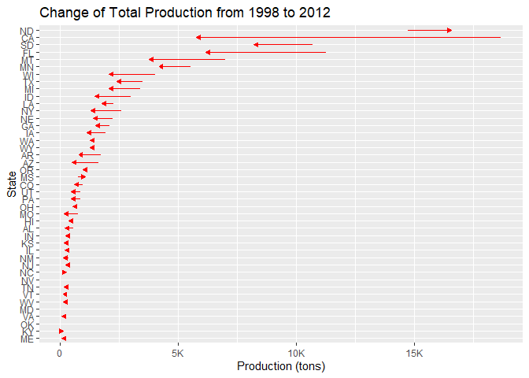

DataScience - Honey Production in the USA
================
Martina Djordjijevic
2022-09-28

- <a href="#introduction" id="toc-introduction">Introduction</a>
- <a href="#data-analysis" id="toc-data-analysis">Data analysis</a>
- <a href="#trends-in-data" id="toc-trends-in-data">Trends in data</a>
- <a href="#conclusion" id="toc-conclusion">Conclusion</a>
- <a href="#references--source-for-dataset"
  id="toc-references--source-for-dataset">References &amp; Source for
  dataset</a>

# Introduction

Bees have been around for many millennia, however in most recent times
the hardworking colonies face many trials and tribulations due to
various factors such as an extensive use of pesticides, loss of habitat
– mostly because of rapid urbanization, unusually warm winters that
cause a shift in plant development etc. The importance of these insects
in the process of pollination is undeniable, valid for both wild bees
and honeybees, hence the rapid decline in the number of their colonies
presents a problem not only on the more global level in the nature, but
also to the world agricultural output economic value.

Back in 2006, there was a huge decline in the honeybee population
reported mostly in North America, which had a huge impact on the
American honey agriculture. This decline was due to the Colony Collapse
Disorder, a phenomenon reported in many countries and continents since
1998.

Let’s take a look at Wikipedia’s definition of this phenomenon:

> > > Colony collapse disorder (CCD) is an abnormal phenomenon that
> > > occurs when the majority of worker bees in a honey bee colony
> > > disappear, leaving behind a queen, plenty of food, and a few nurse
> > > bees to care for the remaining immature bees.

It is important to note that this phenomenon also causes the remaining
hive colony to collapse. The cause of the decline of 2006 is probably to
be found in hive diseases and pesticides harming the pollinators, as
these two processes are highly correlated, though no real consensus was
reached. Ever since the collapse, the American honey industry has been
largely struggling. After the collapse the U.S. is forced to import
large amounts of honey, more precisely 350 of the 400 million pounds
each year, which is in stark contrast to this industries brilliant past
when almost half the honey consumed was produced locally.

The dataset analysed here gives insight into honey production supply and
demand in America by state from 1998 to 2012.

# Data analysis

Firstly, let’s take a quick look at the data we’ll be analyzing.

    ##   state numcol yieldpercol totalprod   stocks priceperlb prodvalue year
    ## 1    AL  16000          71   1136000   159000       0.72    818000 1998
    ## 2    AZ  55000          60   3300000  1485000       0.64   2112000 1998
    ## 3    AR  53000          65   3445000  1688000       0.59   2033000 1998
    ## 4    CA 450000          83  37350000 12326000       0.62  23157000 1998
    ## 5    CO  27000          72   1944000  1594000       0.70   1361000 1998
    ## 6    FL 230000          98  22540000  4508000       0.64  14426000 1998

Here’s also a description of each column’s content:

- *numcol*: Number of honey producing colonies, more precisely the
  maximum number of colonies from which honey was taken during the year.
- *yieldpercol*: Honey yield in pounds per colony.
- *totalprod*: Total production in pounds (numcol x yieldpercol).
- *stocks*: Refers to stocks in pounds held by producers.
- *priceperlb*: Refers to average price per pound, in dollars, based on
  expanded sales.
- *prodvalue*: Value of production in dollars (totalprod x priceperlb).

This dataset is rather rich in information. However the first thing I’d
like to investigate further is the relationship between the states and
number of honey producing colonies. Here let’s assume a **H0** - *states
have no impact on the number of honey producing colonies.* Followed by a
**H1** - *states do have an impact on the number of honey producing
colonies.* Let’s plot a boxplot of state and numcol to verify this.

<!-- -->

Let’s try finding outliers and eliminating them, so our boxplot makes
more sense.

    ##   25%   75% 
    ##  9000 63750

    ## [1] 54750

<!-- -->

The boxplot indicates that there could be some statistical difference
between the variables. To confirm this, let’s calculate the correlation
between states and number of honey producing colonies with an ANOVA.

    ##              Df    Sum Sq   Mean Sq F value Pr(>F)    
    ## state        43 5.012e+12 1.166e+11   394.1 <2e-16 ***
    ## Residuals   582 1.721e+11 2.958e+08                   
    ## ---
    ## Signif. codes:  0 '***' 0.001 '**' 0.01 '*' 0.05 '.' 0.1 ' ' 1

Because the **p-value** is significantly lower than alpha of 0.05, we
can reject the **H0** and conclude that there is a significant
statistical difference between the number of colonies in each state.

We can also plot

<!-- -->

What are some other questions we could pose regarding the data set?
**Which states produce the most honey?**

To see this let’s take a look at the total honey production in every
state. We could plot that on a U.S. map.

<!-- -->

This plot looks lovely, but it’s kind of hard to read. Let’s plot 20
states with the largest production on a histogram.

<!-- -->

In this plot we can see top 20 states in honey production, with North
Dakota(ND), California(CA) South Dakota(SD) and Florida(FL) as the four
major states producing honey.

# Trends in data

We can also look at some existing trends in our dataset. **What happens
to the rates of honey production over time?** because there is a huge
drop of number of colonies existing, it should be expected that the
total honey production is also dropping. Let’s verify if that is
correct.

    ## 'data.frame':    626 obs. of  8 variables:
    ##  $ state      : chr  "AL" "AZ" "AR" "CA" ...
    ##  $ numcol     : num  16000 55000 53000 450000 27000 230000 75000 8000 120000 9000 ...
    ##  $ yieldpercol: int  71 60 65 83 72 98 56 118 50 71 ...
    ##  $ totalprod  : num  1136000 3300000 3445000 37350000 1944000 ...
    ##  $ stocks     : num  159000 1485000 1688000 12326000 1594000 ...
    ##  $ priceperlb : num  0.72 0.64 0.59 0.62 0.7 0.64 0.69 0.77 0.65 1.19 ...
    ##  $ prodvalue  : num  818000 2112000 2033000 23157000 1361000 ...
    ##  $ year       : int  1998 1998 1998 1998 1998 1998 1998 1998 1998 1998 ...

<!-- -->

As seen from the plot above, honey production has been decreasing over
time. But **what about the prices?** We can expect that the price will
increase over time. Let’s verify that.

<!-- --> The
plot confirms that the prices have been going up over the years.

Finally, let’s plot the number of colonies and honey production
together, in order to observe their development over time.

<!-- -->

From this plot we can conclude that *as the number of colonies
decreases, so does the honey production*.

- Additionally, the number of colonies begins dropping from 1999,
  however the honey production is in a surge from 1999 to 2000.This is
  explained by the fact that honey can be collected even from collapsed
  colonies. However, as expected there was a huge drop in honey
  production in the period from 2000 to 2002, which is directly
  influenced by the collapsed colonies from 1999 onward. This pattern is
  found again in the period from 2006 to 2008.

- After 2008 up to 2010 the number of colonies increase rapidly, which
  leads to an increase in production.

# Conclusion

states have no impact on the number of honey producing colonies Which
states produce the most honey? What happens to the rates of production
over time? what about the prices?

# References & Source for dataset

The clean version of this dataset was provided by Kaggle, however the
original raw dataset was from the USDA’s National Agricultural
Statistics Service (NASS).

<a href="https://www.freepik.com/free-photo/closeup-shot-bee-chamomile-flower_13411366.htm#query=bee&position=29&from_view=search&track=sph">Image
by wirestock</a> on Freepik
