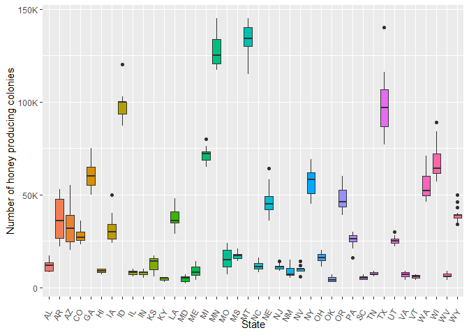
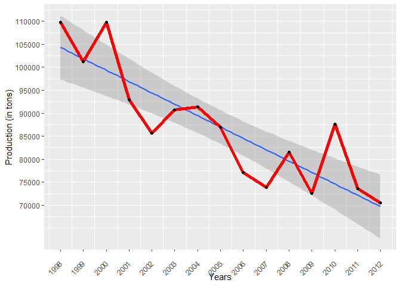

DataScience - Honey Productionin the USA
================
Martina Djordjijevic
2022-09-28

- <a href="#introduction" id="toc-introduction">Introduction</a>
- <a href="#methods" id="toc-methods">Methods</a>
- <a href="#results" id="toc-results">Results</a>
- <a href="#conclusion" id="toc-conclusion">Conclusion</a>
- <a href="#references" id="toc-references">References</a>

# Introduction

Bees have been around for many millennia, however in most recent times
the hardworking colonies face many trials and tribulations due to
various factors such as an extensive use of pesticides, loss of habitat
– mostly because of rapid urbanization, unusually warm winters that
cause a shift in plant development etc. The importance of these insects
in the process of pollination is undeniable, valid for both wild bees
and honeybees, hence the rapid decline in the number of their colonies
presents a problem not only on the more global level in the nature, but
also to the world agricultural output economic value.

Back in 2006, there was a huge decline in the honeybee population
reported mostly in North America, which had a huge impact on the
American honey agriculture. This decline was due to the Colony Collapse
Disorder, a phenomenon reported in many countries and continents since
1998.

Let’s take a look at Wikipedia’s definition of this phenomenon:

> > > Colony collapse disorder (CCD) is an abnormal phenomenon that
> > > occurs when the majority of worker bees in a honey bee colony
> > > disappear, leaving behind a queen, plenty of food, and a few nurse
> > > bees to care for the remaining immature bees.

It is important to note that this phenomenon also causes the remaining
hive colony to collapse. The cause of the decline of 2006 is probably to
be found in hive diseases and pesticides harming the pollinators, as
these two processes are highly correlated, though no real consensus was
reached. Ever since the collapse, the American honey industry has been
largely struggling. After the collapse the U.S. is forced to import
large amounts of honey, more precisely 350 of the 400 million pounds
each year, which is in stark contrast to this industries brilliant past
when almost half the honey consumed was produced locally.

The dataset analysed here gives insight into honey production supply and
demand in America by state from 1998 to 2012.


# Methods

First, let’s calculate the correlation between states and number of
honey producing colonies. This could be done using the following
formula: 1 - the result of variance of the group/ the total variance.

we found a correlation of 0.964, a super one!

``` r
honey <- read.csv("honeyproduction.csv")
library(ggplot2)
library(tidyverse)
```

    ## ── Attaching packages ─────────────────────────────────────── tidyverse 1.3.2 ──
    ## ✔ tibble  3.1.8      ✔ dplyr   1.0.10
    ## ✔ tidyr   1.2.1      ✔ stringr 1.4.1 
    ## ✔ readr   2.1.3      ✔ forcats 0.5.2 
    ## ✔ purrr   0.3.4      
    ## ── Conflicts ────────────────────────────────────────── tidyverse_conflicts() ──
    ## ✖ dplyr::filter() masks stats::filter()
    ## ✖ dplyr::lag()    masks stats::lag()

``` r
library(data.table)
```

    ## 
    ## Attaching package: 'data.table'
    ## 
    ## The following objects are masked from 'package:dplyr':
    ## 
    ##     between, first, last
    ## 
    ## The following object is masked from 'package:purrr':
    ## 
    ##     transpose

``` r
library(dplyr)
state_variance <- honey %>% group_by(state) %>% summarize (variance=var(numcol))
state_count <- honey %>% group_by(state) %>% summarize (count=n())
total_variance <- honey %>% summarize (variance=var(numcol))
state_mean_variance <- sum(state_variance[,2]*state_count[,2])/sum(state_count[,2])
correlation_state_numcol <- round((1 - (state_mean_variance/total_variance)), 3)
correlation_state_numcol[1,1]
```

    ## [1] 0.964

``` r
library(ggplot2)
library(ggpubr)
library(tidyverse)
library(broom)
library(AICcmodavg)
```

    ## Warning: package 'AICcmodavg' was built under R version 4.2.2

``` r
honey <- read.csv("honeyproduction.csv")
one.way <- aov(numcol ~ state, data = honey)

summary(one.way)
```

    ##              Df    Sum Sq   Mean Sq F value Pr(>F)    
    ## state        43 5.012e+12 1.166e+11   394.1 <2e-16 ***
    ## Residuals   582 1.721e+11 2.958e+08                   
    ## ---
    ## Signif. codes:  0 '***' 0.001 '**' 0.01 '*' 0.05 '.' 0.1 ' ' 1

``` r
library(ggplot2)
ggplot(honey, aes(state, numcol))+
  geom_boxplot(aes(fill = state), show.legend = FALSE)+
  theme(axis.text.x = element_text(angle = 60, vjust = 0.5, hjust=1))
```

<!-- -->

# Results

``` r
library(usmap)
```

    ## Warning: package 'usmap' was built under R version 4.2.2

``` r
library(ggplot2)
honey <- read.csv("honeyproduction.csv")
plot_usmap(data = honey, values = "totalprod", color = "black") + 
  scale_fill_continuous(low = "blue", high = "yellow", name = "totalprod", label = scales::comma) + 
  theme(legend.position = "right")
```

    ## Warning: Ignoring unknown parameters: linewidth

<!-- -->

``` r
library(tidyverse)
honey <- read.csv("honeyproduction.csv")

str(honey)
```

    ## 'data.frame':    626 obs. of  8 variables:
    ##  $ state      : chr  "AL" "AZ" "AR" "CA" ...
    ##  $ numcol     : num  16000 55000 53000 450000 27000 230000 75000 8000 120000 9000 ...
    ##  $ yieldpercol: int  71 60 65 83 72 98 56 118 50 71 ...
    ##  $ totalprod  : num  1136000 3300000 3445000 37350000 1944000 ...
    ##  $ stocks     : num  159000 1485000 1688000 12326000 1594000 ...
    ##  $ priceperlb : num  0.72 0.64 0.59 0.62 0.7 0.64 0.69 0.77 0.65 1.19 ...
    ##  $ prodvalue  : num  818000 2112000 2033000 23157000 1361000 ...
    ##  $ year       : int  1998 1998 1998 1998 1998 1998 1998 1998 1998 1998 ...

``` r
honey %>% select(year, totalprod) %>%
 group_by(year) %>%
 summarize(total = sum(totalprod/2000)) %>%
 ggplot(aes(year, total))+
 geom_line(lwd = 2, color = 'midnightblue')+
 scale_x_continuous(breaks = 1998:2012)+
 scale_y_continuous(breaks = seq(from = 70000, to = 110000, by = 5000))+
 labs(y = 'tons', x = '')+
 theme(axis.text.x = element_text(angle = 45, vjust = 0.5, hjust=1),
       panel.grid.major.x = element_blank())
```

<!-- -->

``` r
library(dplyr)
library(ggplot2)

honey %>%
 mutate(percent = totalprod / sum(totalprod)) %>%
 group_by(year) %>%
 summarize(totperc = sum(percent)) %>%
 ggplot(aes(year, totperc))+
 geom_line(lwd = 2, color = 'midnightblue')+
 scale_x_continuous(breaks = 1998:2012)+
 scale_y_continuous(limits = c(0,NA),
                    labels = scales::percent_format())+
 labs(y = '', x = '')+
 theme(axis.text.x = element_text(angle = 45, vjust = 0.5, hjust=1),
       panel.grid.major.x = element_blank())
```

<!-- -->

``` r
library(dplyr)
library(ggplot2)
honey %>% select(year, numcol, totalprod) %>%
 group_by(year) %>%
 summarize(totColo = sum(numcol),
           totProd = sum(totalprod)) %>%
ggplot(aes(year))+
 geom_line(aes(y = totColo/25), lwd = 1.5, color = 'orange')+
 geom_line(aes(y = totProd/2000), lwd = 1.5, color = 'green')+
 theme(axis.text.y = element_text(size = 15))+
 labs(y = 'orange = colonies x 25, green = production tons')+
 scale_x_continuous(breaks = seq(from = 1998, to = 2012, by = 1))+
 scale_y_continuous(breaks = seq(from = 70000, to = 110000, by = 5000))
```

<!-- -->

``` r
library(dplyr)
library(ggplot2)

honey %>% select(state, totalprod) %>%
 group_by(state) %>%
 summarize(total = sum(totalprod/2000)) %>%
 arrange(desc(total)) %>% head(20) %>%
 ggplot(aes(reorder(state, -total), total, fill = state))+
 geom_bar(stat = 'identity')+
 scale_y_continuous(breaks = seq(from = 0, to = 250000, by = 25000))+
 labs(y = 'TONS', x = '')+
 theme(legend.position = "none",
       panel.grid.major = element_blank(),
       axis.text.x = element_text(size = 13),
       axis.text.y = element_text(size = 13))
```

<!-- -->

``` r
library(dplyr)
library(ggplot2)
honey %>% group_by(state, numcol, year) %>%
 summarize(total = sum(numcol/10), .groups = 'keep') %>%
 arrange(desc(total)) %>% head(100) %>%
 ggplot(aes(year, numcol, group = state, color = state))+
 geom_line(lwd = 2)+
 scale_x_continuous(breaks = 1998:2012)+
 scale_y_continuous(breaks = seq(from = 50000, to = 550000, by = 50000))+
 labs(y = 'colonies/state/year', x = '')+
 theme(axis.text.y = element_text(size = 14))+
 ggtitle(label = 'Colonies per state')
```

<!-- -->

``` r
library(dplyr)
library(ggplot2)
honey %>% group_by(state, totalprod, year) %>%
 summarize(total = sum(totalprod), .groups = 'keep') %>%
 arrange(desc(total)) %>% head(100) %>%
 ggplot(aes(year, total, group = state, color = state))+
 geom_line(lwd = 2)+
 scale_x_continuous(breaks = 1998:2012)+
 scale_y_continuous(labels = scales::label_number_si())+
 labs(y = 'prod/state/year', x = '')+
 ggtitle(label = 'Production per state')+
 theme(axis.text.y = element_text(size = 14))
```

    ## Warning: `label_number_si()` was deprecated in scales 1.2.0.
    ## Please use the `scale_cut` argument of `label_number()` instead.

<!-- -->

# Conclusion

# References

The clean version of this dataset was provided by Kaggle, however the
original raw dataset was from the USDA’s National Agricultural
Statistics Service (NASS).

<a href="https://www.freepik.com/free-photo/closeup-shot-bee-chamomile-flower_13411366.htm#query=bee&position=29&from_view=search&track=sph">Image
by wirestock</a> on Freepik
