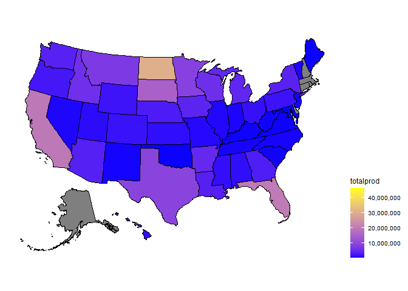

DataScience - Honey Production
================
Martina Djordjijevic
2022-09-28

# Introduction

# Methods

# Results

``` r
library(usmap)
```

    ## Warning: package 'usmap' was built under R version 4.2.2

``` r
library(ggplot2)
honey <- read.csv("honeyproduction.csv")
plot_usmap(data = honey, values = "totalprod", color = "black") + 
  scale_fill_continuous(low = "blue", high = "yellow", name = "totalprod", label = scales::comma) + 
  theme(legend.position = "right")
```

    ## Warning: Ignoring unknown parameters: linewidth

<!-- -->

``` r
library(tidyverse)
```

    ## ── Attaching packages ─────────────────────────────────────── tidyverse 1.3.2 ──
    ## ✔ tibble  3.1.8      ✔ dplyr   1.0.10
    ## ✔ tidyr   1.2.1      ✔ stringr 1.4.1 
    ## ✔ readr   2.1.3      ✔ forcats 0.5.2 
    ## ✔ purrr   0.3.4      
    ## ── Conflicts ────────────────────────────────────────── tidyverse_conflicts() ──
    ## ✖ dplyr::filter() masks stats::filter()
    ## ✖ dplyr::lag()    masks stats::lag()

``` r
honey <- read.csv("honeyproduction.csv")

str(honey)
```

    ## 'data.frame':    626 obs. of  8 variables:
    ##  $ state      : chr  "AL" "AZ" "AR" "CA" ...
    ##  $ numcol     : num  16000 55000 53000 450000 27000 230000 75000 8000 120000 9000 ...
    ##  $ yieldpercol: int  71 60 65 83 72 98 56 118 50 71 ...
    ##  $ totalprod  : num  1136000 3300000 3445000 37350000 1944000 ...
    ##  $ stocks     : num  159000 1485000 1688000 12326000 1594000 ...
    ##  $ priceperlb : num  0.72 0.64 0.59 0.62 0.7 0.64 0.69 0.77 0.65 1.19 ...
    ##  $ prodvalue  : num  818000 2112000 2033000 23157000 1361000 ...
    ##  $ year       : int  1998 1998 1998 1998 1998 1998 1998 1998 1998 1998 ...

``` r
honey %>% select(year, totalprod) %>%
 group_by(year) %>%
 summarize(total = sum(totalprod/2000)) %>%
 ggplot(aes(year, total))+
 geom_line(lwd = 2, color = 'midnightblue')+
 scale_x_continuous(breaks = 1998:2012)+
 scale_y_continuous(breaks = seq(from = 70000, to = 110000, by = 5000))+
 labs(y = 'tons', x = '')+
 theme(axis.text.x = element_text(angle = 45, vjust = 0.5, hjust=1),
       panel.grid.major.x = element_blank())
```

<!-- -->

``` r
library(dplyr)
library(ggplot2)

honey %>%
 mutate(percent = totalprod / sum(totalprod)) %>%
 group_by(year) %>%
 summarize(totperc = sum(percent)) %>%
 ggplot(aes(year, totperc))+
 geom_line(lwd = 2, color = 'midnightblue')+
 scale_x_continuous(breaks = 1998:2012)+
 scale_y_continuous(limits = c(0,NA),
                    labels = scales::percent_format())+
 labs(y = '', x = '')+
 theme(axis.text.x = element_text(angle = 45, vjust = 0.5, hjust=1),
       panel.grid.major.x = element_blank())
```

<!-- -->

``` r
library(dplyr)
library(ggplot2)
honey %>% select(year, numcol, totalprod) %>%
 group_by(year) %>%
 summarize(totColo = sum(numcol),
           totProd = sum(totalprod)) %>%
ggplot(aes(year))+
 geom_line(aes(y = totColo/25), lwd = 1.5, color = 'orange')+
 geom_line(aes(y = totProd/2000), lwd = 1.5, color = 'green')+
 theme(axis.text.y = element_text(size = 15))+
 labs(y = 'orange = colonies x 25, green = production tons')+
 scale_x_continuous(breaks = seq(from = 1998, to = 2012, by = 1))+
 scale_y_continuous(breaks = seq(from = 70000, to = 110000, by = 5000))
```

<!-- -->

``` r
library(dplyr)
library(ggplot2)

honey %>% select(state, totalprod) %>%
 group_by(state) %>%
 summarize(total = sum(totalprod/2000)) %>%
 arrange(desc(total)) %>% head(20) %>%
 ggplot(aes(reorder(state, -total), total, fill = state))+
 geom_bar(stat = 'identity')+
 scale_y_continuous(breaks = seq(from = 0, to = 250000, by = 25000))+
 labs(y = 'TONS', x = '')+
 theme(legend.position = "none",
       panel.grid.major = element_blank(),
       axis.text.x = element_text(size = 13),
       axis.text.y = element_text(size = 13))
```

<!-- -->

``` r
library(dplyr)
library(ggplot2)
honey %>% group_by(state, numcol, year) %>%
 summarize(total = sum(numcol/10), .groups = 'keep') %>%
 arrange(desc(total)) %>% head(100) %>%
 ggplot(aes(year, numcol, group = state, color = state))+
 geom_line(lwd = 2)+
 scale_x_continuous(breaks = 1998:2012)+
 scale_y_continuous(breaks = seq(from = 50000, to = 550000, by = 50000))+
 labs(y = 'colonies/state/year', x = '')+
 theme(axis.text.y = element_text(size = 14))+
 ggtitle(label = 'Colonies per state')
```

<!-- -->

``` r
library(dplyr)
library(ggplot2)
honey %>% group_by(state, totalprod, year) %>%
 summarize(total = sum(totalprod), .groups = 'keep') %>%
 arrange(desc(total)) %>% head(100) %>%
 ggplot(aes(year, total, group = state, color = state))+
 geom_line(lwd = 2)+
 scale_x_continuous(breaks = 1998:2012)+
 scale_y_continuous(labels = scales::label_number_si())+
 labs(y = 'prod/state/year', x = '')+
 ggtitle(label = 'Production per state')+
 theme(axis.text.y = element_text(size = 14))
```

    ## Warning: `label_number_si()` was deprecated in scales 1.2.0.
    ## Please use the `scale_cut` argument of `label_number()` instead.

<!-- -->

# Conclusion

library(tidyverse)
